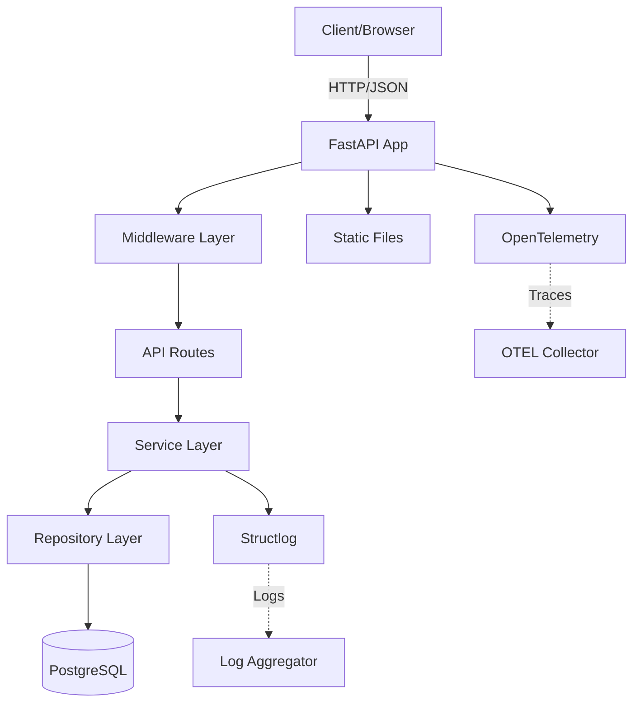
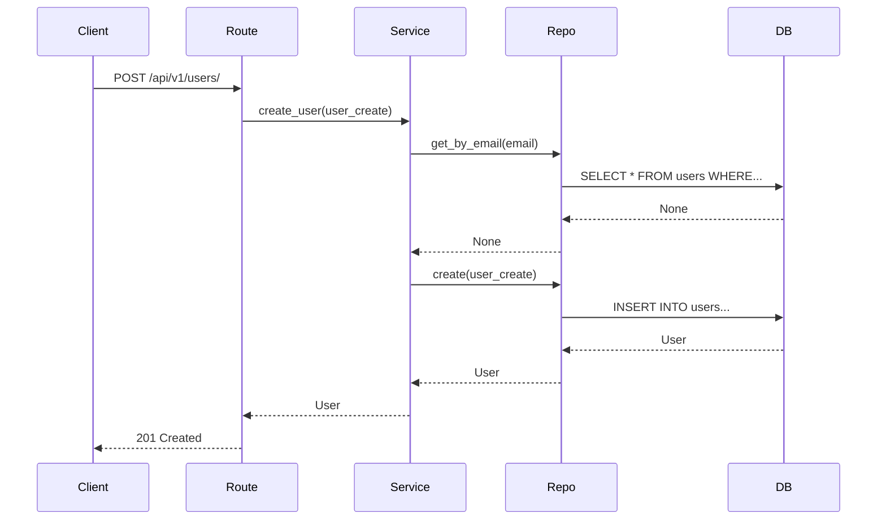
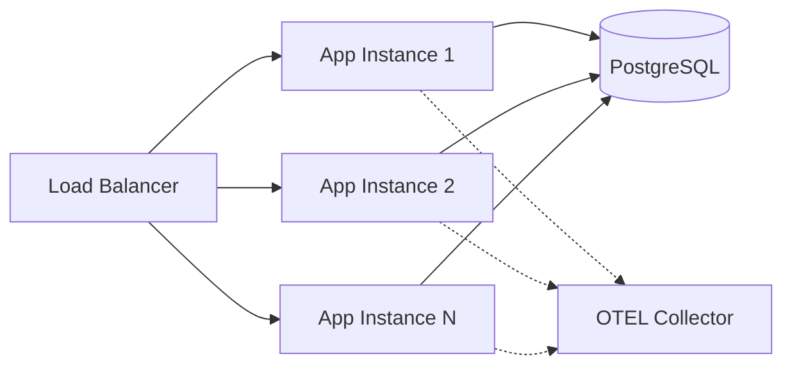
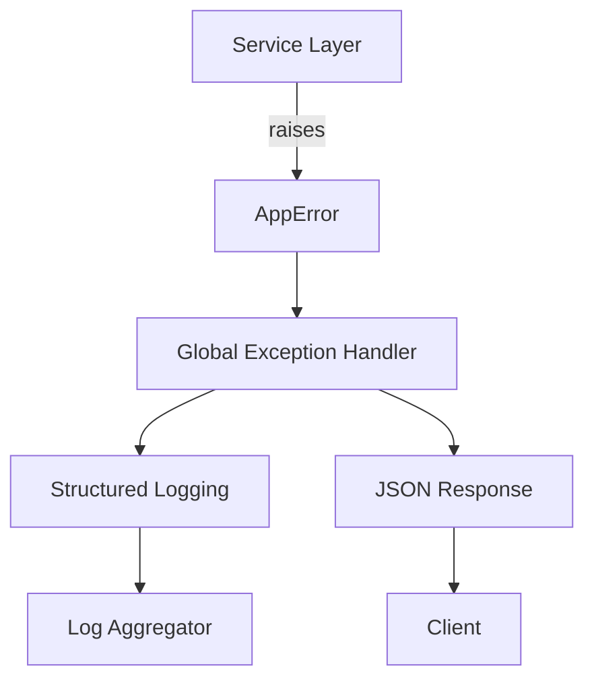

# System Architecture

This document provides a comprehensive overview of the FastAPI Backend
architecture, including component structure, data flow, and integration
patterns.

---

## High-Level Architecture



---

## Component Layers

### 1. Application Layer (`app/main.py`)

The application factory creates and configures the FastAPI application:

```python
def create_app() -> FastAPI:
    @asynccontextmanager
    async def lifespan(app: FastAPI):
        app.state.engine = create_db_engine()
        yield
        await app.state.engine.dispose()

    app = FastAPI(lifespan=lifespan, **OPENAPI_PARAMETERS)
    configure_middlewares(app)
    add_exception_handlers(app)
    setup_opentelemetry(app)
    app.include_router(api_router)
    return app
```

**Responsibilities:**

- Manage application lifecycle (startup/shutdown)
- Configure middlewares and exception handlers
- Set up observability (OTEL, logging)
- Mount static files
- Include API routes

---

### 2. Core Infrastructure (`app/core/`)

Shared infrastructure components used across the application.

#### Configuration (`config.py`)

```python
class Settings(BaseSettings):
    # Environment
    APP_ENV: str = "dev"
    OTEL_ENABLED: bool = True

    # Database
    POSTGRES_HOST: str = "localhost"
    POSTGRES_PORT: int = 5432
    # ...

    @computed_field
    @property
    def DATABASE_URL(self) -> PostgresDsn:
        return PostgresDsn.build(...)
```

Loads settings from `.env` file using Pydantic Settings.

#### Exceptions (`exceptions.py`)

```python
class AppError(Exception):
    def __init__(self, message: str, status_code: int = 500):
        self.message = message
        self.status_code = status_code

class NotFoundError(AppError):
    def __init__(self, message: str = "Resource not found"):
        super().__init__(message, status_code=404)
```

Domain exception hierarchy for business logic errors.

#### Logging (`logging.py`)

Configures **Structlog** for structured, machine-readable logs:

```python
def setup_logging() -> None:
    structlog.configure(
        processors=[
            structlog.contextvars.merge_contextvars,
            structlog.processors.add_log_level,
            structlog.processors.TimeStamper(fmt="iso"),
            structlog.dev.ConsoleRenderer()  # dev
            # structlog.processors.JSONRenderer()  # prod
        ],
    )
```

#### Telemetry (`telemetry.py`)

Sets up **OpenTelemetry** for distributed tracing:

```python
def setup_opentelemetry(app: FastAPI) -> None:
    if not settings.OTEL_ENABLED:
        return

    FastAPIInstrumentor.instrument_app(app)
    SQLAlchemyInstrumentor().instrument()
```

Auto-instruments HTTP requests and database queries.

#### Middlewares (`middlewares.py`)

Configures CORS and other middleware:

```python
def configure_middlewares(app: FastAPI) -> None:
    app.add_middleware(
        CORSMiddleware,
        allow_origins=["*"],
        allow_methods=["*"],
        allow_headers=["*"],
    )
```

---

### 3. Database Layer (`app/db/`)

#### Engine Creation (`session.py`)

```python
def create_db_engine() -> AsyncEngine:
    return create_async_engine(
        str(settings.DATABASE_URL),
        echo=settings.APP_ENV == "dev",
        pool_pre_ping=True,
        pool_size=20,
        max_overflow=10,
    )
```

Stored on `app.state.engine` during application lifespan.

#### Session Injection

```python
async def get_session(request: Request) -> AsyncSession:
    engine = request.app.state.engine
    async_session = async_sessionmaker(engine, ...)
    async with async_session() as session:
        yield session
```

Dependency injection for database sessions.

---

### 4. Feature Modules (`app/modules/`)

Each module follows **Domain-Driven Design** principles:

```
app/modules/user/
├── __init__.py       # Export router
├── models.py         # SQLModel tables
├── schemas.py        # Pydantic request/response
├── repository.py     # Database operations (CRUD)
├── service.py        # Business logic
└── routes.py         # FastAPI endpoints
```

#### Data Flow



#### Layer Responsibilities

| Layer            | Responsibility                | Example                              |
| :--------------- | :---------------------------- | :----------------------------------- |
| **Routes**       | HTTP handling, validation     | `@router.post("/users/")`            |
| **Services**     | Business logic, orchestration | `if existing: raise ConflictError()` |
| **Repositories** | Database operations           | `session.execute(select(User))`      |
| **Models**       | Database schema               | `class User(SQLModel, table=True)`   |
| **Schemas**      | API contracts                 | `class UserCreate(BaseModel)`        |

---

## Request Lifecycle

1. **Client Request** → FastAPI receives HTTP request
2. **Middleware** → CORS, logging, tracing
3. **Router** → Matches URL pattern, validates input (Pydantic)
4. **Service** → Executes business logic, may raise domain exceptions
5. **Repository** → Queries/updates database via SQLModel
6. **Database** → PostgreSQL with asyncpg driver
7. **Response** → Service returns data, router serializes to JSON
8. **Exception Handling** → Global handlers catch `AppError` exceptions
9. **Logging & Tracing** → OTEL spans, structured logs emitted

---

## Database Schema

**Current Tables:**

```sql
CREATE TABLE users (
    id UUID PRIMARY KEY DEFAULT gen_random_uuid(),
    email VARCHAR(255) UNIQUE NOT NULL,
    full_name VARCHAR(255),
    is_active BOOLEAN DEFAULT TRUE,
    created_at TIMESTAMPTZ DEFAULT NOW(),
    updated_at TIMESTAMPTZ DEFAULT NOW()
);

CREATE INDEX idx_users_email ON users(email);
```

Managed via **Alembic** migrations. Schema changes are versioned
and tracked in `alembic/versions/`.

---

## Authentication & Authorization

> [!NOTE]
> **Not Yet Implemented** — Authentication is planned for a future
> release. The architecture is designed to support:
>
> - JWT token-based authentication
> - Role-based access control (RBAC)
> - Per-route authorization decorators

Placeholder for future implementation.

---

## Static Files & Templates

```python
app.mount(
    "/static",
    StaticFiles(directory=Path(__file__).parent / "static"),
    name="static"
)
```

Serves:

- `app/static/css/` — Stylesheets
- `app/static/images/` — Images and icons
- `app/templates/` — Jinja2 templates (root page)

---

## API Versioning

All API routes are versioned:

```python
api_router = APIRouter(prefix="/api/v1")
api_router.include_router(user_router, prefix="/users", tags=["users"])
```

**URL Structure:** `/api/v{version}/{module}/{resource}`

Example: `/api/v1/users/` → User CRUD operations

---

## Deployment Architecture



**Characteristics:**

- **Stateless** application instances (horizontal scaling)
- **Shared** PostgreSQL database (connection pooling)
- **Centralized** observability (OTEL → Jaeger/Tempo)

---

## Concurrency Model

- **Async/Await** throughout the stack
- **asyncpg** for database I/O
- **AsyncSession** for SQLAlchemy operations
- **AsyncClient** for external API calls

```python
async def create_user(self, user_create: UserCreate) -> User:
    # Non-blocking database operations
    existing = await self.repository.get_by_email(user_create.email)
    if existing:
        raise ConflictError(message="Email already registered")
    return await self.repository.create(user_create)
```

Enables handling thousands of concurrent requests with minimal
resource usage.

---

## Error Handling Flow



All business logic errors are converted to HTTP responses
automatically. See [Error Handling Guide](../guides/error-handling.md)
for details.

---

## Testing Architecture

```
tests/
├── conftest.py           # Shared fixtures
├── modules/
│   └── user/
│       ├── test_routes.py      # Integration tests
│       ├── test_service.py     # Business logic tests
│       └── test_repository.py  # Database tests
```

**Strategy:**

- **Integration tests** for routes (full stack)
- **Unit tests** for services (business logic)
- **Database tests** for repositories (real PostgreSQL)

See [Testing Guide](../guides/testing.md) for patterns.

---

## Security Considerations

### Current Measures

1. **Input Validation** — Pydantic schema validation on all inputs
2. **SQL Injection Protection** — SQLAlchemy parameterized queries
3. **CORS Configuration** — Restrictive CORS policy in production
4. **Environment Variables** — Secrets loaded from `.env` (not committed)

### Future Enhancements

- [ ] JWT authentication
- [ ] Rate limiting
- [ ] API key management
- [ ] Field-level encryption for PII

---

## Performance Optimizations

1. **Connection Pooling** — PostgreSQL connection pool (size: 20)
2. **Async I/O** — Non-blocking database and HTTP operations
3. **Database Indexes** — Indexed `users.email` for fast lookups
4. **Lazy Loading** — OTEL disabled in dev for faster startup

---

## See Also

- [Design Decisions](design-decisions.md) — Why we chose these technologies
- [Error Handling](../guides/error-handling.md) — Exception architecture
- [Database Migrations](../guides/database-migrations.md) — Schema management
- [Observability](../guides/observability.md) — Logging and tracing
