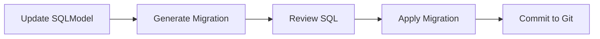

# Database Migrations

This guide explains how to manage database schema changes using Alembic,
the migration tool for SQLAlchemy and SQLModel.

---

## Overview

The application uses [Alembic](https://alembic.sqlalchemy.org/) to manage
database schema migrations. All schema changes must be defined as SQLModel
classes and captured in versioned migration scripts.

> [!IMPORTANT]
> **Never modify the database schema manually.** Always generate migrations
> from code changes.

---

## Workflow



---

## Creating Migrations

### 1. Update Your Models

Modify your SQLModel classes in `app/modules/*/models.py`:

```python
# app/modules/user/models.py
class User(SQLModel, table=True):
    __tablename__ = "users"

    id: uuid.UUID = Field(default_factory=uuid.uuid4, primary_key=True)
    email: str = Field(unique=True, index=True, max_length=255)
    full_name: str | None = Field(default=None, max_length=255)
    is_active: bool = Field(default=True)
    # NEW: Add a phone number field
    phone: str | None = Field(default=None, max_length=20)
```

### 2. Generate Migration Script

Use the `just migrate-gen` command with a descriptive message:

```bash
just migrate-gen "add phone field to users table"
```

This runs `alembic revision --autogenerate -m "message"` and creates a new
migration file in `alembic/versions/`:

```
alembic/versions/abc123def456_add_phone_field_to_users_table.py
```

### 3. Review the Generated SQL

**Always review the generated migration** before applying it:

```python
# alembic/versions/abc123def456_add_phone_field_to_users_table.py
def upgrade() -> None:
    op.add_column('users', sa.Column('phone', sa.String(length=20)))

def downgrade() -> None:
    op.drop_column('users', 'phone')
```

Common issues to check:

- Data loss operations (e.g., dropping columns with data)
- Missing NOT NULL constraints on new columns
- Index creation on large tables (consider `CONCURRENTLY`)
- Foreign key constraints

### 4. Apply the Migration

```bash
just migrate-up
```

This runs `alembic upgrade head` to apply all pending migrations.

### 5. Commit to Git

```bash
git add alembic/versions/abc123def456_*.py
git commit -m "feat(user): add phone field to user model"
```

---

## Alembic Commands

All commands are wrapped in the [`justfile`](https://github.com/balakmran/fastapi-backend/blob/main/justfile):

| Command                  | Alembic Equivalent                         | Description                  |
| :----------------------- | :----------------------------------------- | :--------------------------- |
| `just migrate-gen "msg"` | `alembic revision --autogenerate -m "msg"` | Generate migration           |
| `just migrate-up`        | `alembic upgrade head`                     | Apply all pending migrations |
| `just migrate-down`      | `alembic downgrade -1`                     | Rollback last migration      |
| `just migrate-history`   | `alembic history`                          | Show migration history       |
| `just migrate-current`   | `alembic current`                          | Show current revision        |

---

## Configuration

Alembic configuration is stored in [`alembic.ini`](https://github.com/balakmran/fastapi-backend/blob/main/alembic.ini)
and [`alembic/env.py`](https://github.com/balakmran/fastapi-backend/blob/main/alembic/env.py).

### Database URL

The database URL is automatically loaded from environment variables via
`Settings.DATABASE_URL`:

```python
# alembic/env.py
from app.core.config import settings

config.set_main_option("sqlalchemy.url", str(settings.DATABASE_URL))
```

### SQLModel Metadata

All SQLModel tables are automatically discovered:

```python
# alembic/env.py
from sqlmodel import SQLModel
from app.modules.user.models import User  # Import all models

target_metadata = SQLModel.metadata
```

---

## Best Practices

### Naming Migrations

Use descriptive names that explain **what** changed:

```bash
✅ just migrate-gen "add email verification fields"
✅ just migrate-gen "create orders table"
✅ just migrate-gen "add index on user email"

❌ just migrate-gen "update database"
❌ just migrate-gen "changes"
```

### Handling Data Migrations

For operations that require data transformation, use **two-step migrations**:

**Step 1**: Add new column as nullable

```python
def upgrade() -> None:
    op.add_column('users', sa.Column('email_verified', sa.Boolean(), nullable=True))
```

**Step 2**: Backfill data and add NOT NULL constraint

```python
def upgrade() -> None:
    # Backfill data
    op.execute("UPDATE users SET email_verified = false WHERE email_verified IS NULL")
    # Add constraint
    op.alter_column('users', 'email_verified', nullable=False)
```

### Complex Migrations

For complex changes, manually edit the generated migration:

```python
def upgrade() -> None:
    # Create new table
    op.create_table('user_profiles',
        sa.Column('id', sa.UUID(), primary_key=True),
        sa.Column('user_id', sa.UUID(), nullable=False),
        sa.ForeignKeyConstraint(['user_id'], ['users.id'], ondelete='CASCADE'),
    )

    # Migrate data from old structure
    op.execute("""
        INSERT INTO user_profiles (id, user_id, ...)
        SELECT gen_random_uuid(), id, ... FROM users
    """)
```

---

## Production Deployments

### Option 1: Run Migrations in Dockerfile

```dockerfile
# Add to Dockerfile
COPY alembic/ alembic/
COPY alembic.ini .

# Run migrations on container start
CMD ["sh", "-c", "alembic upgrade head && uvicorn app.main:app --host 0.0.0.0"]
```

### Option 2: Separate Migration Job

Run migrations as a separate one-off job before deploying:

```bash
# Kubernetes Job
kubectl run migrations --image=myapp:latest --command -- alembic upgrade head

# Docker Compose
docker-compose run app alembic upgrade head
```

---

## Rollback Strategy

### Rolling Back Migrations

```bash
# Rollback last migration
just migrate-down

# Rollback to specific revision
alembic downgrade abc123def456
```

### Testing Rollbacks

Always test that `downgrade()` works:

```bash
# Test upgrade/downgrade cycle
just migrate-up
just migrate-down
just migrate-up
```

---

## Troubleshooting

### "Target database is not up to date"

```
FAILED: Target database is not up to date.
```

**Solution**: Apply pending migrations first:

```bash
just migrate-up
```

### "Can't locate revision identified by 'xyz'"

**Solution**: The migration history is out of sync. Check:

```bash
# What migrations exist in code?
ls alembic/versions/

# What revision is the database at?
just migrate-current
```

### Autogenerate Doesn't Detect Changes

Common causes:

1. **Model not imported** in `alembic/env.py`
2. **Different driver** between runtime and migrations (asyncpg vs psycopg)
3. **SQLModel metadata not set** as target_metadata

**Solution**: Add import to [`alembic/env.py`](https://github.com/balakmran/fastapi-backend/blob/main/alembic/env.py):

```python
from app.modules.user.models import User
from app.modules.product.models import Product  # Add new models here
```

---

## Quick Reference

| Task                         | Command                      |
| ---------------------------- | ---------------------------- |
| Generate migration           | `just migrate-gen "message"` |
| Apply migrations             | `just migrate-up`            |
| Rollback one step            | `just migrate-down`          |
| View history                 | `alembic history`            |
| View current revision        | `alembic current`            |
| Stamp head (without running) | `alembic stamp head`         |

---

## See Also

- [Alembic Documentation](https://alembic.sqlalchemy.org/)
- [SQLModel Documentation](https://sqlmodel.tiangolo.com/)
- [alembic/env.py](https://github.com/balakmran/fastapi-backend/blob/main/alembic/env.py) — Migration configuration
