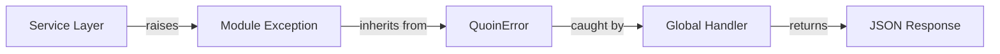

# Error Handling

This guide explains the error handling architecture in the FastAPI Backend, including custom domain exceptions, module-level exceptions, global exception handlers, and best practices for error management.

---

## Architecture Overview

The application uses a **module-level exception** pattern where business logic errors are represented by custom exception classes that extend core `QuoinError` classes. These exceptions are automatically caught by global handlers and converted to appropriate HTTP responses.



---

## Exception Hierarchy

All application exceptions inherit from [`QuoinError`](https://github.com/balakmran/fastapi-backend/blob/main/app/core/exceptions.py):

```python
from app.core.exceptions import QuoinError

class QuoinError(Exception):
    \"\"\"Base exception for all Quoin application errors.\"\"\"

    def __init__(
        self,
        message: str,
        status_code: int = 500,
        headers: dict[str, str] | None = None,
    ) -> None:
        super().__init__(message)
        self.message = message
        self.status_code = status_code
        self.headers = headers
```

### Built-in Core Exception Classes

| Exception                     | Status Code | Use Case                                  |
| :---------------------------- | :---------- | :---------------------------------------- |
| `BadRequestError`             | 400         | Invalid request data or parameters        |
| `ForbiddenError`              | 403         | Insufficient permissions                  |
| `NotFoundError`               | 404         | Resource not found                        |
| `ConflictError`               | 409         | Resource conflict (e.g., duplicate email) |
| `InternalServerError`         | 500         | Unexpected server errors                  |
| `QuoinRequestValidationError` | 422         | Pydantic validation errors                |

---

## Module-Level Exceptions

Each module defines domain-specific exceptions that inherit from core exceptions and provide rich context:

```python
# app/modules/user/exceptions.py
from app.core.exceptions import ConflictError, NotFoundError

class UserNotFoundError(NotFoundError):
    \"\"\"Raised when a user cannot be found.\"\"\"

    def __init__(self, user_id: str) -> None:
        super().__init__(message=f\"User with ID '{user_id}' not found\")

class DuplicateEmailError(ConflictError):
    \"\"\"Raised when attempting to create a user with an existing email.\"\"\"

    def __init__(self, email: str) -> None:
        super().__init__(message=f\"Email '{email}' is already registered\")
```

### Benefits of Module-Level Exceptions

1. **Rich Context**: Exceptions include relevant IDs, values, and details
2. **Type Safety**: Each exception is a distinct type for better error handling
3. **Discoverability**: Clearly defined in each module's `exceptions.py`
4. **Maintainability**: Easier to track and update error messages

---

## Usage in Services

**Always raise module-specific exceptions in service layers**, not HTTP exceptions:

```python
from app.modules.user.exceptions import DuplicateEmailError, UserNotFoundError

class UserService:
    async def create_user(self, user_create: UserCreate) -> User:
        # Check for conflicts
        existing = await self.repository.get_by_email(user_create.email)
        if existing:
            raise DuplicateEmailError(email=user_create.email)

        return await self.repository.create(user_create)

    async def get_user(self, user_id: uuid.UUID) -> User:
        user = await self.repository.get(user_id)
        if not user:
            raise UserNotFoundError(user_id=str(user_id))
        return user
```

> [!IMPORTANT]
> Never raise `HTTPException` from services. Services should be HTTP-agnostic.

---

## Global Exception Handlers

The [`quoin_exception_handler`](https://github.com/balakmran/fastapi-backend/blob/main/app/core/exception_handlers.py) automatically converts `QuoinError` exceptions to JSON responses:

```python
async def quoin_exception_handler(
    request: Request, exc: QuoinError
) -> Response:
    logger.warning(
        \"quoin_error\",
        message=exc.message,
        status_code=exc.status_code,
        path=request.url.path,
    )
    return JSONResponse(
        status_code=exc.status_code,
        content={\"detail\": exc.message},
        headers=exc.headers,
    )
```

The [`validation_exception_handler`](https://github.com/balakmran/fastapi-backend/blob/main/app/core/exception_handlers.py) handles Pydantic validation errors:

```python
async def validation_exception_handler(
    request: Request, exc: ValidationError
) -> Response:
    logger.warning(
        \"validation_error\",
        errors=exc.errors(),
        path=request.url.path,
    )
    return JSONResponse(
        status_code=422,
        content={\"detail\": exc.errors()},
    )
```

These handlers are registered in [`main.py`](https://github.com/balakmran/fastapi-backend/blob/main/app/main.py):

```python
from app.core.exception_handlers import add_exception_handlers

app = FastAPI(...)
add_exception_handlers(app)
```

---

## Error Response Format

All errors return a consistent JSON structure:

```json
{
  \"detail\": \"Email 'existing@example.com' is already registered\"
}
```

Example API error response with rich context:

```bash
POST /api/v1/users/
{
  \"email\": \"existing@example.com\",
  \"full_name\": \"John Doe\"
}

# Response: 409 Conflict
{
  \"detail\": \"Email 'existing@example.com' is already registered\"
}
```

---

## Creating Custom Module Exceptions

For new modules, create an `exceptions.py` file with domain-specific errors:

```python
# app/modules/billing/exceptions.py
from app.core.exceptions import BadRequestError, NotFoundError

class PaymentFailedError(BadRequestError):
    \"\"\"Raised when payment processing fails.\"\"\"

    def __init__(self, payment_id: str, reason: str) -> None:
        super().__init__(
            message=f\"Payment '{payment_id}' failed: {reason}\"
        )

class InvoiceNotFoundError(NotFoundError):
    \"\"\"Raised when an invoice cannot be found.\"\"\"

    def __init__(self, invoice_id: str) -> None:
        super().__init__(
            message=f\"Invoice with ID '{invoice_id}' not found\"
        )
```

Then use in services:

```python
from app.modules.billing.exceptions import PaymentFailedError

class BillingService:
    async def charge(self, payment_id: str, amount: Decimal) -> Payment:
        try:
            result = await self.gateway.charge(amount)
        except GatewayError as e:
            raise PaymentFailedError(payment_id=payment_id, reason=str(e))
        return result
```

---

## Logging

All `QuoinError` exceptions are automatically logged with structured logging:

```json
{
  \"event\": \"quoin_error\",
  \"message\": \"User with ID 'f47ac10b-58cc-4372-a567-0e02b2c3d479' not found\",
  \"status_code\": 404,
  \"path\": \"/api/v1/users/f47ac10b-58cc-4372-a567-0e02b2c3d479\",
  \"timestamp\": \"2026-02-16T15:30:00.000000\",
  \"level\": \"warning\"
}
```

---

## Validation Errors

FastAPI's built-in validation errors (from Pydantic) are handled automatically:

```bash
POST /api/v1/users/
{
  \"email\": \"not-an-email\",
  \"full_name\": \"John Doe\"
}

# Response: 422 Unprocessable Entity
{
  \"detail\": [
    {
      \"type\": \"value_error\",
      \"loc\": [\"body\", \"email\"],
      \"msg\": \"value is not a valid email address\",
      \"input\": \"not-an-email\"
    }
  ]
}
```

---

## Best Practices

### ✅ Do

- Create module-specific exception classes that inherit from core exceptions
- Include relevant context (IDs, values) in exception messages
- Raise domain exceptions from services with rich context
- Use descriptive error messages that help debugging
- Let the global handlers convert exceptions to HTTP responses

### ❌ Don't

- Raise `HTTPException` from services or repositories
- Use generic exceptions like `ValueError` or `RuntimeError`
- Return error responses directly from services
- Catch exceptions in routes (let handlers do it)
- Use base `QuoinError` directly (use specific subclasses or create custom ones)

---

## Testing

Test error handling at the service level:

```python
import pytest
from app.modules.user.exceptions import UserNotFoundError

async def test_get_user_not_found(user_service):
    with pytest.raises(UserNotFoundError) as exc_info:
        await user_service.get_user(uuid.uuid4())

    assert \"not found\" in str(exc_info.value.message)
    assert exc_info.value.status_code == 404
```

For integration tests, validate the HTTP response:

```python
async def test_create_user_duplicate_email(client):
    # Create first user
    await client.post(\"/api/v1/users/\", json={
        \"email\": \"test@example.com\",
        \"full_name\": \"Test User\"
    })

    # Try to create duplicate
    response = await client.post(\"/api/v1/users/\", json={
        \"email\": \"test@example.com\",
        \"full_name\": \"Another User\"
    })

    assert response.status_code == 409
    assert \"test@example.com\" in response.json()[\"detail\"]
    assert \"already registered\" in response.json()[\"detail\"]
```

---

## See Also

- [Core Exceptions](https://github.com/balakmran/fastapi-backend/blob/main/app/core/exceptions.py) — Source code
- [Exception Handlers](https://github.com/balakmran/fastapi-backend/blob/main/app/core/exception_handlers.py) — Handler implementation
- [User Module Exceptions](https://github.com/balakmran/fastapi-backend/blob/main/app/modules/user/exceptions.py) — Example module exceptions
- [User Service Example](https://github.com/balakmran/fastapi-backend/blob/main/app/modules/user/service.py) — Real-world usage
