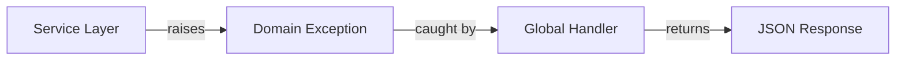

# Error Handling

This guide explains the error handling architecture in the FastAPI Backend,
including custom domain exceptions, global exception handlers, and best
practices for error management.

---

## Architecture Overview

The application uses a **domain exception** pattern where business logic errors
are represented by custom exception classes that extend a base `AppError` class.
These exceptions are automatically caught by global handlers and converted to
appropriate HTTP responses.



---

## Exception Hierarchy

All application exceptions inherit from [`AppError`](https://github.com/balakmran/fastapi-backend/blob/main/app/core/exceptions.py):

```python
from app.core.exceptions import AppError

class AppError(Exception):
    def __init__(
        self,
        message: str,
        status_code: int = 500,
        headers: dict[str, str] | None = None,
    ) -> None:
        super().__init__(message)
        self.message = message
        self.status_code = status_code
        self.headers = headers
```

### Built-in Exception Classes

| Exception             | Status Code | Use Case                                  |
| :-------------------- | :---------- | :---------------------------------------- |
| `BadRequestError`     | 400         | Invalid request data or parameters        |
| `ForbiddenError`      | 403         | Insufficient permissions                  |
| `NotFoundError`       | 404         | Resource not found                        |
| `ConflictError`       | 409         | Resource conflict (e.g., duplicate email) |
| `InternalServerError` | 500         | Unexpected server errors                  |

---

## Usage in Services

**Always raise domain exceptions in service layers**, not HTTP exceptions:

```python
from app.core.exceptions import NotFoundError, ConflictError

class UserService:
    async def create_user(self, user_create: UserCreate) -> User:
        # Check for conflicts
        existing = await self.repository.get_by_email(user_create.email)
        if existing:
            raise ConflictError(message="Email already registered")

        return await self.repository.create(user_create)

    async def get_user(self, user_id: uuid.UUID) -> User:
        user = await self.repository.get(user_id)
        if not user:
            raise NotFoundError(message="User not found")
        return user
```

> [!IMPORTANT]
> Never raise `HTTPException` from services. Services should be HTTP-agnostic.

---

## Global Exception Handler

The [`app_exception_handler`](https://github.com/balakmran/fastapi-backend/blob/main/app/core/exception_handlers.py#L10-L24)
automatically converts `AppError` exceptions to JSON responses:

```python
async def app_exception_handler(
    request: Request, exc: AppError
) -> JSONResponse:
    logger.warning(
        "app_error",
        message=exc.message,
        status_code=exc.status_code,
        path=request.url.path,
    )
    return JSONResponse(
        status_code=exc.status_code,
        content={"detail": exc.message},
        headers=exc.headers,
    )
```

This handler is registered in [`main.py`](https://github.com/balakmran/fastapi-backend/blob/main/app/main.py#L30):

```python
from app.core.exception_handlers import add_exception_handlers

app = FastAPI(...)
add_exception_handlers(app)
```

---

## Error Response Format

All errors return a consistent JSON structure:

```json
{
  "detail": "Email already registered"
}
```

Example API error response:

```bash
POST /api/v1/users/
{
  "email": "existing@example.com",
  "full_name": "John Doe"
}

# Response: 409 Conflict
{
  "detail": "Email already registered"
}
```

---

## Creating Custom Exceptions

For module-specific errors, create subclasses of `AppError`:

```python
# app/modules/billing/exceptions.py
from app.core.exceptions import AppError

class PaymentFailedError(AppError):
    def __init__(self, message: str = "Payment processing failed"):
        super().__init__(message, status_code=402)

class InsufficientFundsError(AppError):
    def __init__(self, message: str = "Insufficient funds"):
        super().__init__(message, status_code=402)
```

Then use in services:

```python
from app.modules.billing.exceptions import PaymentFailedError

class BillingService:
    async def charge(self, amount: Decimal) -> Payment:
        if amount > self.balance:
            raise InsufficientFundsError(
                message=f"Balance {self.balance} < {amount}"
            )
        # ... process payment
```

---

## Logging

All `AppError` exceptions are automatically logged with structured logging:

```json
{
  "event": "app_error",
  "message": "User not found",
  "status_code": 404,
  "path": "/api/v1/users/123e4567-e89b-12d3-a456-426614174000",
  "timestamp": "2026-02-15T15:30:00.000000",
  "level": "warning"
}
```

---

## Validation Errors

FastAPI's built-in validation errors (from Pydantic) are handled automatically:

```bash
POST /api/v1/users/
{
  "email": "not-an-email",
  "full_name": "John Doe"
}

# Response: 422 Unprocessable Entity
{
  "detail": [
    {
      "type": "value_error",
      "loc": ["body", "email"],
      "msg": "value is not a valid email address",
      "input": "not-an-email"
    }
  ]
}
```

---

## Best Practices

### ✅ Do

- Raise domain exceptions from services
- Use descriptive error messages
- Create custom exception classes for domain-specific errors
- Let the global handler convert exceptions to HTTP responses

### ❌ Don't

- Raise `HTTPException` from services or repositories
- Use generic exceptions like `ValueError` or `RuntimeError`
- Return error responses directly from services
- Catch exceptions in routes (let handlers do it)

---

## Testing

Test error handling using `pytest.raises`:

```python
import pytest
from app.core.exceptions import NotFoundError

async def test_get_user_not_found(user_service):
    with pytest.raises(NotFoundError) as exc_info:
        await user_service.get_user(uuid.uuid4())

    assert exc_info.value.message == "User not found"
    assert exc_info.value.status_code == 404
```

For integration tests, validate the HTTP response:

```python
async def test_create_user_duplicate_email(client):
    # Create first user
    await client.post("/api/v1/users/", json={
        "email": "test@example.com",
        "full_name": "Test User"
    })

    # Try to create duplicate
    response = await client.post("/api/v1/users/", json={
        "email": "test@example.com",
        "full_name": "Another User"
    })

    assert response.status_code == 409
    assert response.json() == {"detail": "Email already registered"}
```

---

## See Also

- [Core Exceptions](https://github.com/balakmran/fastapi-backend/blob/main/app/core/exceptions.py) — Source code
- [Exception Handlers](https://github.com/balakmran/fastapi-backend/blob/main/app/core/exception_handlers.py) — Handler implementation
- [User Service Example](https://github.com/balakmran/fastapi-backend/blob/main/app/modules/user/service.py) — Real-world usage
