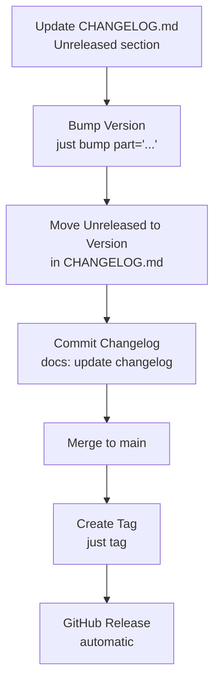

# Release Workflow

This guide covers version management, release tagging, and the changelog process.

## 🔖 Semantic Versioning

We follow [Semantic Versioning (SemVer)](https://semver.org/) for all releases:

- **MAJOR** version (1.0.0 → 2.0.0) - Breaking changes
- **MINOR** version (1.0.0 → 1.1.0) - New features (backward compatible)
- **PATCH** version (1.0.0 → 1.0.1) - Bug fixes (backward compatible)

---

## Release Workflow Diagram

Visual overview of the complete release process:



---

## 🚀 Release Process

### 1. Update CHANGELOG.md

Before bumping the version, document your changes in `CHANGELOG.md`:

```markdown
## [Unreleased]

### Added

- New user authentication endpoints

### Fixed

- Database connection pool timeout issue
```

Follow the [Keep a Changelog](https://keepachangelog.com/) format.

---

### 2. Bump Version

Increment the version number in `pyproject.toml` and `app/__init__.py`:

```bash
# For a patch release (0.1.0 → 0.1.1)
just bump

# For a minor release (0.1.0 → 0.2.0)
just bump minor

# For a major release (0.1.0 → 1.0.0)
just bump major
```

This command automatically:

- Updates version in `pyproject.toml`
- Updates `__version__` in `app/__init__.py`

---

### 3. Update Changelog Version

Move the `[Unreleased]` section to the new version:

```markdown
## [1.2.0] - 2026-02-15

### Added

- New user authentication endpoints

### Fixed

- Database connection pool timeout issue

## [Unreleased]

(Empty - next development cycle)
```

Commit this change:

```bash
git add CHANGELOG.md
git commit -m "docs: update changelog for v1.2.0"
```

---

### 4. Create Release Tag

After merging the version bump to `main`, create and push a Git tag:

```bash
just tag
```

This command:

1. Creates an annotated Git tag (e.g., `v1.2.0`)
2. Pushes the tag to the remote repository
3. Triggers the GitHub Release workflow

---

### 5. GitHub Release

The GitHub Actions workflow automatically:

- Creates a GitHub Release from the tag
- Extracts release notes from `CHANGELOG.md`
- Attaches build artifacts (if configured)

View releases at:
[https://github.com/balakmran/quoin-api/releases](https://github.com/balakmran/quoin-api/releases)

---

## 📋 Conventional Commits

Use [Conventional Commits](https://www.conventionalcommits.org/) for clear
commit history:

| Type        | Description           | Changelog Section |
| ----------- | --------------------- | ----------------- |
| `feat:`     | New feature           | Added             |
| `fix:`      | Bug fix               | Fixed             |
| `docs:`     | Documentation changes | Changed           |
| `style:`    | Code formatting       | -                 |
| `refactor:` | Code refactoring      | Changed           |
| `test:`     | Test updates          | -                 |
| `chore:`    | Build/tooling changes | -                 |

**Examples:**

```bash
git commit -m "feat(user): add password reset endpoint"
git commit -m "fix(db): resolve connection pool timeout"
git commit -m "docs: update deployment guide"
```

---

## 🔄 Release Checklist

Before creating a release:

- [ ] All tests pass (`just check`)
- [ ] `CHANGELOG.md` is updated with all changes
- [ ] Version is bumped (`just bump part="..."`)
- [ ] Changes are merged to `main` branch
- [ ] Tag is created and pushed (`just tag`)
- [ ] GitHub Release is created automatically
- [ ] Documentation is deployed

---

## 🐛 Hotfix Releases

For critical bug fixes that need immediate release:

1. **Create hotfix branch** from `main`:

   ```bash
   git checkout -b hotfix/critical-bug-fix main
   ```

2. **Fix the bug** and commit:

   ```bash
   git commit -m "fix: resolve critical security issue"
   ```

3. **Bump patch version**:

   ```bash
   just bump part="patch"
   ```

4. **Update changelog**, commit, and merge to `main`

5. **Create tag**:
   ```bash
   just tag
   ```

---

## 📦 Pre-releases

For beta or release candidate versions:

```bash
# Manual version bump (not automated by just)
# In pyproject.toml and app/__init__.py
__version__ = "1.2.0-beta.1"

# Create pre-release tag
git tag v1.2.0-beta.1
git push origin v1.2.0-beta.1
```

Mark as "Pre-release" in GitHub when creating the release.

---

## See Also

- [Deployment Guide](deployment.md) — Deploying releases to production
- [Conventional Commits](https://www.conventionalcommits.org/) — Commit message format
- [Semantic Versioning](https://semver.org/) — Version numbering scheme
- [justfile](https://github.com/balakmran/quoin-api/blob/main/justfile) — Automation commands
