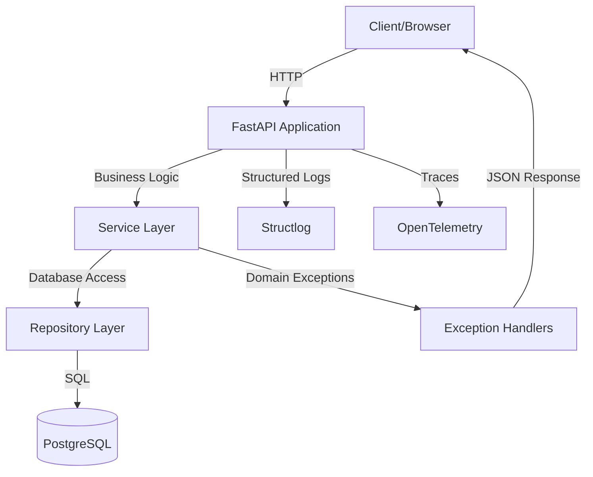

# QuoinAPI

---

[](https://github.com/balakmran/quoin-api/actions/workflows/ci.yml)
[](https://www.python.org/downloads/)
[](https://opensource.org/licenses/MIT)
[](https://github.com/astral-sh/ruff)

**The architectural cornerstone for high-performance, scalable Python services** built with **FastAPI**,
**SQLModel**, and **PostgreSQL**. Features a production-ready stack with strict
type checking, structured logging, and OpenTelemetry observability.

---

## 🚀 Key Features

- **High Performance**: Async I/O with FastAPI and Pydantic.
- **Type Safe**: 100% type-annotated, verified by `ty`.
- **Observable**: Integrated OpenTelemetry traces and structured logging.
- **Developer First**: Powered by `uv` for package management and `just` for
  automation.

---

## 🛠️ Tech Stack

- **Core**: FastAPI, SQLModel, Pydantic Settings
- **Database**: PostgreSQL, AsyncPG, Alembic
- **Tooling**: uv, Ruff, Ty, Pytest
- **Observability**: OpenTelemetry, Structlog

Learn more about our [technology choices and design decisions →](architecture/design-decisions.md)

---

## ⚡️ Quick Start

```bash
# 1. Setup project (install dependencies & pre-commit hooks)
just setup

# 2. Start database (Docker)
just db

# 3. Run migrations
just migrate-up

# 4. Start server
just run
```

Visit the API documentation at
[http://127.0.0.1:8000/docs](http://127.0.0.1:8000/docs).

**Need help?** Check out the [Getting Started Guide →](guides/getting-started.md)

---

## 📸 Running Application


The application home page provides real-time health indicators and quick links
to API documentation.

---

## ️ Architecture



Read the [full architecture documentation →](architecture/overview.md)

---

## 📂 Project Structure

```plaintext
├── app/
│   ├── core/
│   │   ├── config.py             # Pydantic settings
│   │   ├── exceptions.py         # Custom exceptions
│   │   ├── exception_handlers.py # Global exception handlers
│   │   ├── logging.py            # Structlog configuration
│   │   ├── metadata.py           # Application metadata
│   │   ├── middlewares.py        # Middleware configuration
│   │   ├── openapi.py            # OpenAPI configuration
│   │   └── telemetry.py          # OpenTelemetry instrumentation
│   ├── db/                       # Database connection & base models
│   ├── modules/
│   │   ├── system/               # System health & status
│   │   └── user/                 # User management module
│   │       ├── models.py         # SQLModel database tables
│   │       ├── schemas.py        # Pydantic request/response models
│   │       ├── repository.py     # Database access (CRUD)
│   │       ├── service.py        # Business logic
│   │       └── routes.py         # FastAPI router endpoints
│   ├── static/                   # Static assets
│   ├── templates/                # Jinja2 templates
│   └── main.py                   # Application entry point
├── tests/                        # Pytest test suite
├── alembic/                      # Database migrations
├── docs/                         # This documentation
├── scripts/                      # Utility scripts
├── .env.example                  # Environment variables template
├── docker-compose.yml            # Local dev environment
├── Dockerfile                    # Production Docker image
├── justfile                      # Task runner
└── pyproject.toml                # Dependencies & config
```

---

## 📖 Documentation

| Section                                         | Description                                                                                                             |
| ----------------------------------------------- | ----------------------------------------------------------------------------------------------------------------------- |
| **📚 [Guides](guides/getting-started.md)**      | Step-by-step guides for getting started, configuration, error handling, testing, database migrations, and observability |
| **🏗️ [Architecture](architecture/overview.md)** | System architecture overview, design decisions, component diagrams, and data flow                                       |
| **🔌 [API Reference](api/overview.md)**         | Complete API documentation with core modules, user module, REST endpoints, and code examples                            |
| **📋 [Project Info](project/contributing.md)**  | Contributing guide, changelog, license (MIT), and GitHub repository                                                     |

---

## 🤝 Contributing

We welcome contributions! Please read our [Contributing Guide](project/contributing.md)
to learn about our development process, coding standards, and how to submit pull
requests.

---

## 📜 License

This project is licensed under the **MIT License**. See the [LICENSE](project/license.md)
for details.

---

## 🔗 Quick Links

- **GitHub Repository**: [balakmran/quoin-api](https://github.com/balakmran/quoin-api)
- **API Docs (Swagger)**: [http://127.0.0.1:8000/docs](http://127.0.0.1:8000/docs)
- **API Docs (ReDoc)**: [http://127.0.0.1:8000/redoc](http://127.0.0.1:8000/redoc)
- **Changelog**: [View version history](project/changelog.md)
